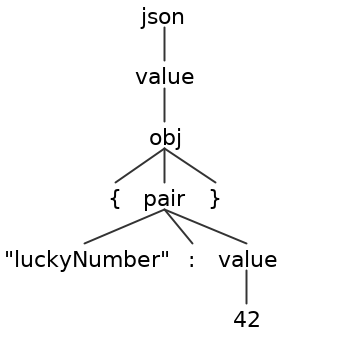

class: center, middle

# Parsing 
# (with ANTLR)
### Who needs regular expressions? *

<br/>

<sub>* You probably need regular expressions way more often than parsers. </sup>

---
## Who am I?

.no-bullets[
* CS degree from MTSU in 2000
* Professional developer, mostly web development
* Dabbled in management and architecture
* Currently an instructor at the Nashville Software School

* https://twitter.com/askingalot
* https://github.com/askingalot
* https://www.linkedin.com/in/andy-collins
]

???
* Andy
* proud of software school

---
## This talk

.no-bullets.bigger[
* Intro to parsing
* Intro to the ANTLR4 parser generator
* Practical (???) example
]

???
* I told Carl I wanted to talk, but didn't have a subject.
* Always interested in programming languages
* every talk needs a story
* Not building a compiler
* story of this talk
    * error log parsing
    * boss comes to you wants to know where to put dev effort
* Mostly this is fun
* Talk driven study
* Just want you to know enough to know where to start googling (duck duck go)
* Not an expert. Ask Carl for your money back.

---
## Error Log

```sh
---------------------- Mar  5 2019  4:12PM Win32NT   6.2.9200.0 ClearBindingsTrans Object reference not set to an instance of an object.  Exception Type: System.NullReferenceException  Application: Product v4.6.2.0  Assembly: Product.frmDetailOrders, ProductAgPM, Version=4.6.2.0, Culture=neutral, PublicKeyToken=null  Function: ClearBindingsTrans    Error: Object reference not set to an instance of an object.  Stack Trace:     at Product.frmDetailOrders.ClearBindingsTrans(Boolean ClearDataset)     at Product.frmDetailOrders.ClearBindings()     at Product.frmDetailOrders.frmDetailOrders_Activated(Object sender, EventArgs e)     at Product.frmDetailOrders.frmDetailOrders_Load(Object sender, EventArgs e)     at System.EventHandler.Invoke(Object sender, EventArgs e)     at System.Windows.Forms.Form.OnLoad(EventArgs e)     at System.Windows.Forms.Form.OnCreateControl()     at System.Windows.Forms.Control.CreateControl(Boolean fIgnoreVisible)     at System.Windows.Forms.Control.CreateControl()     at System.Windows.Forms.Control.WmShowWindow(Message& m)     at System.Windows.Forms.Control.WndProc(Message& m)     at System.Windows.Forms.ScrollableControl.WndProc(Message& m)     at System.Windows.Forms.Form.WmShowWindow(Message& m)     at System.Windows.Forms.Form.WndProc(Message& m)     at Product.SomeCompanySystems.Shared.AppFramework.SomeCompanyFormBase.WndProc(Message& m)     at System.Windows.Forms.Control.ControlNativeWindow.OnMessage(Message& m)     at System.Windows.Forms.Control.ControlNativeWindow.WndProc(Message& m)     at System.Windows.Forms.NativeWindow.Callback(IntPtr hWnd, Int32 msg, IntPtr wparam, IntPtr lparam)
---------------------- Mar  5 2019  4:51PM Win32NT   6.2.9200.0 ValidateCommand ExecuteNonQuery requires the command to have a transaction when the connection assigned to the command is in a pending local transaction.  The Transaction property of the command has not been initialized.  Exception Type: System.InvalidOperationException  Application: Product v4.6.2.0  Assembly: System.Data.SqlClient.SqlCommand, System.Data, Version=4.0.0.0, Culture=neutral, PublicKeyToken=b77a5c561934e089  Function: ValidateCommand    Error: ExecuteNonQuery requires the command to have a transaction when the connection assigned to the command is in a pending local transaction.  The Transaction property of the command has not been initialized.  Stack Trace:     at System.Data.SqlClient.SqlCommand.ValidateCommand(String method, Boolean async)     at System.Data.SqlClient.SqlCommand.InternalExecuteNonQuery(TaskCompletionSource`1 completion, String methodName, Boolean sendToPipe, Int32 timeout, Boolean& usedCache, Boolean asyncWrite, Boolean inRetry)     at System.Data.SqlClient.SqlCommand.ExecuteNonQuery()     at Product.SomeCompanyMethodsData.CmdExecuteNonQuery(String cmdString, Boolean HandleEx, SqlTransaction MyTrans, Int32 TimeOut, SqlConnection Connection, Int32& RecordsAffected)     at Product.SomeCompanyMethodsData.RemoveTempTable(String tempTableName, SqlTransaction transaction, SqlConnection connection)     at Product.frmSizeableOpenOrdersDispatch.GetCurrentDispatchingFieldsForMap()     at Product.frmSizeableOpenOrdersDispatch.UpdateMapViewModels()     at Product.frmSizeableOpenOrdersDispatch.GetData(Object sender, EventArgs e)     at Product.frmSizeableOpenOrdersDispatch.btnRefresh_Click(Object sender, EventArgs e)     at System.Windows.Forms.Control.OnClick(EventArgs e)     at System.Windows.Forms.Button.OnClick(EventArgs e)     at System.Windows.Forms.Button.OnMouseUp(MouseEventArgs mevent)     at System.Windows.Forms.Control.WmMouseUp(Message& m, MouseButtons button, Int32 clicks)     at System.Windows.Forms.Control.WndProc(Message& m)     at System.Windows.Forms.ButtonBase.WndProc(Message& m)     at System.Windows.Forms.Button.WndProc(Message& m)     at System.Windows.Forms.Control.ControlNativeWindow.OnMessage(Message& m)     at System.Windows.Forms.Control.ControlNativeWindow.WndProc(Message& m)     at System.Windows.Forms.NativeWindow.Callback(IntPtr hWnd, Int32 msg, IntPtr wparam, IntPtr lparam)
---------------------- Mar  5 2019  5:00PM Win32NT   6.2.9200.0 frmLogin_Closing Object reference not set to an instance of an object.  Exception Type: System.NullReferenceException  Application: Product v4.6.2.0  Assembly: Product.frmLogin, ProductAgPM, Version=4.6.2.0, Culture=neutral, PublicKeyToken=null  Function: frmLogin_Closing    Error: Object reference not set to an instance of an object.  Stack Trace:     at Product.frmLogin.frmLogin_Closing(Object sender, CancelEventArgs e)     at System.Windows.Forms.Form.OnClosing(CancelEventArgs e)     at System.Windows.Forms.Form.WmClose(Message& m)     at System.Windows.Forms.Form.WndProc(Message& m)     at System.Windows.Forms.Control.ControlNativeWindow.OnMessage(Message& m)     at System.Windows.Forms.Control.ControlNativeWindow.WndProc(Message& m)     at System.Windows.Forms.NativeWindow.Callback(IntPtr hWnd, Int32 msg, IntPtr wparam, IntPtr lparam)
---------------------- Mar  6 2019  9:20AM Win32NT   6.2.9200.0 OnError A transport-level error has occurred when sending the request to the server. (provider: TCP Provider, error: 0 - An existing connection was forcibly closed by the remote host.)  Exception Type: System.Data.SqlClient.SqlException  Application: Product v4.6.2.0  Assembly: System.Data.SqlClient.SqlConnection, System.Data, Version=4.0.0.0, Culture=neutral, PublicKeyToken=b77a5c561934e089  Function: OnError    Error: A transport-level error has occurred when sending the request to the server. (provider: TCP Provider, error: 0 - An existing connection was forcibly closed by the remote host.)  Stack Trace:     at System.Data.SqlClient.SqlConnection.OnError(SqlException exception, Boolean breakConnection, Action`1 wrapCloseInAction)     at System.Data.SqlClient.SqlInternalConnection.OnError(SqlException exception, Boolean breakConnection, Action`1 wrapCloseInAction)     at System.Data.SqlClient.TdsParser.ThrowExceptionAndWarning(TdsParserStateObject stateObj, Boolean callerHasConnectionLock, Boolean asyncClose)     at System.Data.SqlClient.TdsParserStateObject.SNIWritePacket(SNIHandle handle, SNIPacket packet, UInt32& sniError, Boolean canAccumulate, Boolean callerHasConnectionLock)     at System.Data.SqlClient.TdsParserStateObject.WriteSni(Boolean canAccumulate)     at System.Data.SqlClient.TdsParserStateObject.WritePacket(Byte flushMode, Boolean canAccumulate)     at System.Data.SqlClient.TdsParserStateObject.ExecuteFlush()     at System.Data.SqlClient.TdsParser.TdsExecuteSQLBatch(String text, Int32 timeout, SqlNotificationRequest notificationRequest, TdsParserStateObject stateObj, Boolean sync, Boolean callerHasConnectionLock, Byte[] enclavePackage)     at System.Data.SqlClient.SqlCommand.RunExecuteReaderTds(CommandBehavior cmdBehavior, RunBehavior runBehavior, Boolean returnStream, Boolean async, Int32 timeout, Task& task, Boolean asyncWrite, Boolean inRetry, SqlDataReader ds, Boolean describeParameterEncryptionRequest)     at System.Data.SqlClient.SqlCommand.RunExecuteReader(CommandBehavior cmdBehavior, RunBehavior runBehavior, Boolean returnStream, String method, TaskCompletionSource`1 completion, Int32 timeout, Task& task, Boolean& usedCache, Boolean asyncWrite, Boolean inRetry)     at System.Data.SqlClient.SqlCommand.RunExecuteReader(CommandBehavior cmdBehavior, RunBehavior runBehavior, Boolean returnStream, String method)     at System.Data.SqlClient.SqlCommand.ExecuteScalar()     at Product.SomeCompanyMethodsData.CmdExecuteScalarStr(String cmdString, SqlTransaction myTrans, Int32 timeOut, Boolean handleEx, SqlConnection connection, SqlCommand command)    *** Inner Exception ***  Exception Type: System.ComponentModel.Win32Exception  Application: Product v4.6.2.0  Error: An existing connection was forcibly closed by the remote host    
---------------------- Mar  6 2019  9:40AM Win32NT   6.2.9200.0 OnError A transport-level error has occurred when sending the request to the server. (provider: TCP Provider, error: 0 - An existing connection was forcibly closed by the remote host.)  Exception Type: System.Data.SqlClient.SqlException  Application: Product v4.6.2.0  Assembly: System.Data.SqlClient.SqlConnection, System.Data, Version=4.0.0.0, Culture=neutral, PublicKeyToken=b77a5c561934e089  Function: OnError    Error: A transport-level error has occurred when sending the request to the server. (provider: TCP Provider, error: 0 - An existing connection was forcibly closed by the remote host.)  Stack Trace:     at System.Data.SqlClient.SqlConnection.OnError(SqlException exception, Boolean breakConnection, Action`1 wrapCloseInAction)     at System.Data.SqlClient.SqlInternalConnection.OnError(SqlException exception, Boolean breakConnection, Action`1 wrapCloseInAction)     at System.Data.SqlClient.TdsParser.ThrowExceptionAndWarning(TdsParserStateObject stateObj, Boolean callerHasConnectionLock, Boolean asyncClose)     at System.Data.SqlClient.TdsParserStateObject.SNIWritePacket(SNIHandle handle, SNIPacket packet, UInt32& sniError, Boolean canAccumulate, Boolean callerHasConnectionLock)     at System.Data.SqlClient.TdsParserStateObject.WriteSni(Boolean canAccumulate)     at System.Data.SqlClient.TdsParserStateObject.WritePacket(Byte flushMode, Boolean canAccumulate)     at System.Data.SqlClient.TdsParserStateObject.ExecuteFlush()     at System.Data.SqlClient.TdsParser.TdsExecuteSQLBatch(String text, Int32 timeout, SqlNotificationRequest notificationRequest, TdsParserStateObject stateObj, Boolean sync, Boolean callerHasConnectionLock, Byte[] enclavePackage)     at System.Data.SqlClient.SqlCommand.RunExecuteReaderTds(CommandBehavior cmdBehavior, RunBehavior runBehavior, Boolean returnStream, Boolean async, Int32 timeout, Task& task, Boolean asyncWrite, Boolean inRetry, SqlDataReader ds, Boolean describeParameterEncryptionRequest)     at System.Data.SqlClient.SqlCommand.RunExecuteReader(CommandBehavior cmdBehavior, RunBehavior runBehavior, Boolean returnStream, String method, TaskCompletionSource`1 completion, Int32 timeout, Task& task, Boolean& usedCache, Boolean asyncWrite, Boolean inRetry)     at System.Data.SqlClient.SqlCommand.RunExecuteReader(CommandBehavior cmdBehavior, RunBehavior runBehavior, Boolean returnStream, String method)     at System.Data.SqlClient.SqlCommand.ExecuteScalar()     at Product.SomeCompanyMethodsData.CmdExecuteScalarStr(String cmdString, SqlTransaction myTrans, Int32 timeOut, Boolean handleEx, SqlConnection connection, SqlCommand command)    *** Inner Exception ***  Exception Type: System.ComponentModel.Win32Exception  Application: Product v4.6.2.0  Error: An existing connection was forcibly closed by the remote host    
---------------------- Mar  6 2019 10:23AM Win32NT   6.2.9200.0 OnError Subquery returned more than 1 value. This is not permitted when the subquery follows =, !=, <, <= , >, >= or when the subquery is used as an expression.  Exception Type: System.Data.SqlClient.SqlException  Application: Product v4.6.2.0  Assembly: System.Data.SqlClient.SqlConnection, System.Data, Version=4.0.0.0, Culture=neutral, PublicKeyToken=b77a5c561934e089  Function: OnError    Error: Subquery returned more than 1 value. This is not permitted when the subquery follows =, !=, <, <= , >, >= or when the subquery is used as an expression.  Stack Trace:     at System.Data.SqlClient.SqlConnection.OnError(SqlException exception, Boolean breakConnection, Action`1 wrapCloseInAction)     at System.Data.SqlClient.SqlInternalConnection.OnError(SqlException exception, Boolean breakConnection, Action`1 wrapCloseInAction)     at System.Data.SqlClient.TdsParser.ThrowExceptionAndWarning(TdsParserStateObject stateObj, Boolean callerHasConnectionLock, Boolean asyncClose)     at System.Data.SqlClient.TdsParser.TryRun(RunBehavior runBehavior, SqlCommand cmdHandler, SqlDataReader dataStream, BulkCopySimpleResultSet bulkCopyHandler, TdsParserStateObject stateObj, Boolean& dataReady)     at System.Data.SqlClient.SqlDataReader.TryHasMoreRows(Boolean& moreRows)     at System.Data.SqlClient.SqlDataReader.TryReadInternal(Boolean setTimeout, Boolean& more)     at System.Data.SqlClient.SqlDataReader.Read()     at System.Data.Common.DataAdapter.FillLoadDataRow(SchemaMapping mapping)     at System.Data.Common.DataAdapter.FillFromReader(DataSet dataset, DataTable datatable, String srcTable, DataReaderContainer dataReader, Int32 startRecord, Int32 maxRecords, DataColumn parentChapterColumn, Object parentChapterValue)     at System.Data.Common.DataAdapter.Fill(DataSet dataSet, String srcTable, IDataReader dataReader, Int32 startRecord, Int32 maxRecords)     at System.Data.Common.DbDataAdapter.FillInternal(DataSet dataset, DataTable[] datatables, Int32 startRecord, Int32 maxRecords, String srcTable, IDbCommand command, CommandBehavior behavior)     at System.Data.Common.DbDataAdapter.Fill(DataSet dataSet, Int32 startRecord, Int32 maxRecords, String srcTable, IDbCommand command, CommandBehavior behavior)     at System.Data.Common.DbDataAdapter.Fill(DataSet dataSet, String srcTable)     at Product.SomeCompanyMethodsData.FillDetail(String cmdString, String DataTableName, SqlTransaction MyTrans, Boolean Append, Int32 TimeOut, Boolean HandleEx, CommandType cmdType, SqlConnection Connection, DataSet dtst, SqlCommand command, SqlDataAdapter dataAdapter)     at Product.frmCGDetailAssemblyOrders.GridMaterialsPopulate()     at Product.frmCGDetailAssemblyOrders.DataPopulate()     at Product.frmCGDetailAssemblyOrders.btnSelectAssembly_Click(Object sender, EventArgs e)
---------------------- Mar  6 2019 10:23AM Win32NT   6.2.9200.0 OnError Subquery returned more than 1 value. This is not permitted when the subquery follows =, !=, <, <= , >, >= or when the subquery is used as an expression.  Exception Type: System.Data.SqlClient.SqlException  Application: Product v4.6.2.0  Assembly: System.Data.SqlClient.SqlConnection, System.Data, Version=4.0.0.0, Culture=neutral, PublicKeyToken=b77a5c561934e089  Function: OnError    Error: Subquery returned more than 1 value. This is not permitted when the subquery follows =, !=, <, <= , >, >= or when the subquery is used as an expression.  Stack Trace:     at System.Data.SqlClient.SqlConnection.OnError(SqlException exception, Boolean breakConnection, Action`1 wrapCloseInAction)     at System.Data.SqlClient.SqlInternalConnection.OnError(SqlException exception, Boolean breakConnection, Action`1 wrapCloseInAction)     at System.Data.SqlClient.TdsParser.ThrowExceptionAndWarning(TdsParserStateObject stateObj, Boolean callerHasConnectionLock, Boolean asyncClose)     at System.Data.SqlClient.TdsParser.TryRun(RunBehavior runBehavior, SqlCommand cmdHandler, SqlDataReader dataStream, BulkCopySimpleResultSet bulkCopyHandler, TdsParserStateObject stateObj, Boolean& dataReady)     at System.Data.SqlClient.SqlDataReader.TryHasMoreRows(Boolean& moreRows)     at System.Data.SqlClient.SqlDataReader.TryReadInternal(Boolean setTimeout, Boolean& more)     at System.Data.SqlClient.SqlDataReader.Read()     at System.Data.Common.DataAdapter.FillLoadDataRow(SchemaMapping mapping)     at System.Data.Common.DataAdapter.FillFromReader(DataSet dataset, DataTable datatable, String srcTable, DataReaderContainer dataReader, Int32 startRecord, Int32 maxRecords, DataColumn parentChapterColumn, Object parentChapterValue)     at System.Data.Common.DataAdapter.Fill(DataSet dataSet, String srcTable, IDataReader dataReader, Int32 startRecord, Int32 maxRecords)     at System.Data.Common.DbDataAdapter.FillInternal(DataSet dataset, DataTable[] datatables, Int32 startRecord, Int32 maxRecords, String srcTable, IDbCommand command, CommandBehavior behavior)     at System.Data.Common.DbDataAdapter.Fill(DataSet dataSet, Int32 startRecord, Int32 maxRecords, String srcTable, IDbCommand command, CommandBehavior behavior)     at System.Data.Common.DbDataAdapter.Fill(DataSet dataSet, String srcTable)     at Product.SomeCompanyMethodsData.FillDetail(String cmdString, String DataTableName, SqlTransaction MyTrans, Boolean Append, Int32 TimeOut, Boolean HandleEx, CommandType cmdType, SqlConnection Connection, DataSet dtst, SqlCommand command, SqlDataAdapter dataAdapter)     at Product.frmCGDetailAssemblyOrders.GridMaterialsPopulate()     at Product.frmCGDetailAssemblyOrders.DataPopulate()     at Product.SomeCompanySystems.Shared.AppFramework.SomeCompanyFormBaseDetailSingle.RefreshDetail(Object sender, EventArgs e)     at Product.SomeCompanySystems.Shared.AppFramework.SomeCompanyFormBaseDetailSingle.btnCancel_Click(Object sender, EventArgs e)     at Product.frmCGDetailAssemblyOrders.btnCancel_Click(Object sender, EventArgs e)     at System.Windows.Forms.Control.OnClick(EventArgs e)     at System.Windows.Forms.Button.OnClick(EventArgs e)     at System.Windows.Forms.Button.OnMouseUp(MouseEventArgs mevent)     at System.Windows.Forms.Control.WmMouseUp(Message& m, MouseButtons button, Int32 clicks)     at System.Windows.Forms.Control.WndProc(Message& m)     at System.Windows.Forms.ButtonBase.WndProc(Message& m)     at System.Windows.Forms.Button.WndProc(Message& m)     at System.Windows.Forms.Control.ControlNativeWindow.OnMessage(Message& m)     at System.Windows.Forms.Control.ControlNativeWindow.WndProc(Message& m)     at System.Windows.Forms.NativeWindow.Callback(IntPtr hWnd, Int32 msg, IntPtr wparam, IntPtr lparam)
---------------------- Mar  6 2019 11:08AM Win32NT   6.2.9200.0 Substring Length cannot be less than zero.  Parameter name: length  Exception Type: System.ArgumentOutOfRangeException  Application: Product v4.6.2.0  Assembly: System.String, mscorlib, Version=4.0.0.0, Culture=neutral, PublicKeyToken=b77a5c561934e089  Function: Substring    Error: Length cannot be less than zero.  Parameter name: length  Stack Trace:     at System.String.Substring(Int32 startIndex, Int32 length)     at Product.frmDetailOrders.PrepareDataCommit(Object sender, EventArgs e)     at Product.SomeCompanySystems.Shared.AppFramework.SomeCompanyFormBaseDetailSingle.btnSave_Click(Object sender, EventArgs e)     at Product.frmDetailOrders.btnSave_Click(Object sender, EventArgs e)     at Product.frmDetailOrders.CreateRebillOrder(String originalOrderNumber, String customerId, String newTankId, String currentOperator)     at Product.frmDetailOrders.btnReturn_Click(Object sender, EventArgs e)
---------------------- Mar  6 2019 11:12AM Win32NT   6.2.9200.0 Substring Length cannot be less than zero.  Parameter name: length  Exception Type: System.ArgumentOutOfRangeException  Application: Product v4.6.2.0  Assembly: System.String, mscorlib, Version=4.0.0.0, Culture=neutral, PublicKeyToken=b77a5c561934e089  Function: Substring    Error: Length cannot be less than zero.  Parameter name: length  Stack Trace:     at System.String.Substring(Int32 startIndex, Int32 length)     at Product.frmDetailOrders.PrepareDataCommit(Object sender, EventArgs e)     at Product.SomeCompanySystems.Shared.AppFramework.SomeCompanyFormBaseDetailSingle.btnSave_Click(Object sender, EventArgs e)     at Product.frmDetailOrders.btnSave_Click(Object sender, EventArgs e)     at Product.frmDetailOrders.CreateRebillOrder(String originalOrderNumber, String customerId, String newTankId, String currentOperator)     at Product.frmDetailOrders.btnReturn_Click(Object sender, EventArgs e)
---------------------- Mar  6 2019 12:59PM Win32NT   6.2.9200.0 OnError A transport-level error has occurred when sending the request to the server. (provider: TCP Provider, error: 0 - An existing connection was forcibly closed by the remote host.)  Exception Type: System.Data.SqlClient.SqlException  Application: Product v4.6.2.0  Assembly: System.Data.SqlClient.SqlConnection, System.Data, Version=4.0.0.0, Culture=neutral, PublicKeyToken=b77a5c561934e089  Function: OnError    Error: A transport-level error has occurred when sending the request to the server. (provider: TCP Provider, error: 0 - An existing connection was forcibly closed by the remote host.)  Stack Trace:     at System.Data.SqlClient.SqlConnection.OnError(SqlException exception, Boolean breakConnection, Action`1 wrapCloseInAction)     at System.Data.SqlClient.SqlInternalConnection.OnError(SqlException exception, Boolean breakConnection, Action`1 wrapCloseInAction)     at System.Data.SqlClient.TdsParser.ThrowExceptionAndWarning(TdsParserStateObject stateObj, Boolean callerHasConnectionLock, Boolean asyncClose)     at System.Data.SqlClient.TdsParserStateObject.SNIWritePacket(SNIHandle handle, SNIPacket packet, UInt32& sniError, Boolean canAccumulate, Boolean callerHasConnectionLock)     at System.Data.SqlClient.TdsParserStateObject.WriteSni(Boolean canAccumulate)     at System.Data.SqlClient.TdsParserStateObject.WritePacket(Byte flushMode, Boolean canAccumulate)     at System.Data.SqlClient.TdsParserStateObject.ExecuteFlush()     at System.Data.SqlClient.TdsParser.TdsExecuteSQLBatch(String text, Int32 timeout, SqlNotificationRequest notificationRequest, TdsParserStateObject stateObj, Boolean sync, Boolean callerHasConnectionLock, Byte[] enclavePackage)     at System.Data.SqlClient.SqlCommand.RunExecuteReaderTds(CommandBehavior cmdBehavior, RunBehavior runBehavior, Boolean returnStream, Boolean async, Int32 timeout, Task& task, Boolean asyncWrite, Boolean inRetry, SqlDataReader ds, Boolean describeParameterEncryptionRequest)     at System.Data.SqlClient.SqlCommand.RunExecuteReader(CommandBehavior cmdBehavior, RunBehavior runBehavior, Boolean returnStream, String method, TaskCompletionSource`1 completion, Int32 timeout, Task& task, Boolean& usedCache, Boolean asyncWrite, Boolean inRetry)     at System.Data.SqlClient.SqlCommand.RunExecuteReader(CommandBehavior cmdBehavior, RunBehavior runBehavior, Boolean returnStream, String method)     at System.Data.SqlClient.SqlCommand.ExecuteScalar()     at Product.SomeCompanyMethodsData.CmdExecuteScalarStr(String cmdString, SqlTransaction myTrans, Int32 timeOut, Boolean handleEx, SqlConnection connection, SqlCommand command)    *** Inner Exception ***  Exception Type: System.ComponentModel.Win32Exception  Application: Product v4.6.2.0  Error: An existing connection was forcibly closed by the remote host    
```
.big.no-bullets[
**Some questions**
* What are the top 5 errors?
* What are the top 5 methods that appear in  stacktraces?
* What times of day are we having errors?
]

???
* Parts of the log
    * some dashes
    * Date time
    * windows version
    * multiple instances of error
    * Exception type
    * Error message
    * stack trace
* How do we answer these questions?

---
## Answering the Questions

.bigger[
1. Regular Expressions?
]

???
* How do we answer the questions about the log files?
k
---
## Answering the Questions

.bigger[
1. Regular Expressions?
1. String Methods?
]

???
* How do we answer the questions about the log files?

---
## Answering the Questions

.bigger[
1. Regular Expressions?
1. String Methods?
1. Manually reverse-engineer a grammar from the log file, feed it into a parser generator, generate a parser in C#, write a C# application to use the generated parser.
]

???
* How do we answer the questions about the log files?
* Use a compiler technology!

---
## Answering the Questions

### Of course we'll pick...

<br/> <br/>
.center.biggest[ 3! ]

---
## Answering the Questions
.center.biggest[ Demo ]

???
* switch to mirror
* Show log file
* Show the app run use less 


---
## Parsing / Syntactic Analysis

.big[
> Process of analyzing a string of symbols, either in natural language, computer languages or data structures, conforming to the rules of a formal grammar. 
]
.right[ --wikipedia]

<br/> <br/>

.bigger[
> 1. Get some text 
> 1. Make sure it looks right
> 1. Do something with it
]
.right[ --me]

???
* Students know - Start with some vocabulary
* Wikipedia definition
* My definition
* Often in context of programming languages, but any text will do
* later we'll see examples of CSV and error log file parsing
* "make sure it looks right" is important. Make sure the input adheres to the grammar of a language.
* Errors if it doesn't parse!

---
## Lexing / Tokenizing
.big[
> Process of grouping characters in an input stream into logical units or "tokens".
]
<br/> <br/>
### Example
```json
{ "luckyNumber": 42 }
```
.center[ ...might be converted to this stream of tokens... ]
```sh
L_BRACE IDENTIFIER("luckyNumber") COLON NUMBER(42) R_BRACE
```

???
* We do this automatically when reading. Don't see the individual characters, we see each word as a single unit.
* Point out each token and lexeme
* The first part of the process

---
## You've done all this before...
---
## You've done all this before...
### Remember learning to read?
```md
Teacher: Sound it out...
You: A - P - P - L - E... Apple!
```

???
* When we first learn to read we see each letter as separate
* Later we see each word and even phrases

---
## You've done all this before...
### Remember 8<sup>th</sup> grade?

.center.img[

]

???
* we use tokens in our diagram
* This is a Reed-Kellogg diagram
* It's analogous to a parse tree
* Mr Harmon 
* But something closer would be...
j
---
## You've done all this before...
### Remember 8<sup>th</sup> grade?

.center.img[

]


???
* This diagram is more like what we'll build
* But not quite...

---
## Parsing Process
.left.big[
1. Read input string
1. Tokenize input into token stream
1. Syntax Analysis / Create parse tree
1. Do something with the parse tree
1. ???
1. Profit.
]

.right.img[

]

???
* Image is for a compiler or interpreter
* Walk through process
* parsING is the whole process
* the parsER is the thing that converts tokens to a parse tree
* Let's talk about this parse tree next

---
## Parsing Process

```json
{ "luckyNumber": 42 }
```
**Tokens**
```sh
L_BRACE IDENTIFIER("luckyNumber") COLON NUMBER(42) R_BRACE
```
**Parse Tree (a.k.a. Syntax Tree)**
.center.parse-tree-img.img[

]

???
* picture was built with antlr tools
* Parse tree or syntax tree is the deliverable of the parsing process

---
## More Vocabulary

.big[
* **Language**: A Set of valid sentences. Sentences are composed of phrases, which are composed of subphrases, etc...
* **Grammar**: Formally defines the syntax rules of a language. Each _rule_ in a grammar expresses the structure of a subphrase. 
* **Parser generator**: A program for making parsers. A parser generator's output is source code that implements a parser.
]

???
* In a programing language a sentence would be a statement or expression.
* In a log file one log entry would be a sentence
* A grammar definition is written down in a particular notation.
* List of rules (a.k.a. productions)
* Backus-Naur form
* A parser generator turns a grammar definition into a parser for a particular language
* Maybe you've heard of yacc or bison
* There are so many others...
* We'll use antlr
* It's possible to write a lexer and parser by hand, but it's a complex process, so why do it?

---
## ANTLR
.big[
* ANother Tool for Language Recognition
* Written in Java
* Current (final) version is 4
* Created by Terence Parr
* Parser Generator for
    * Java. 
    * C#
    * Python (2 and 3)
    * JavaScript
    * Go
    * C++
    * Swift
]

???
**25 minutes**
* graduate project
* started 1989. released 1992
* Terence says it's the last version
* has a specific grammar file format (g4)
    * kinda BNF
* do need to install java
* Recursive descent parser
* ALL(*)

---
## A CSV Grammar

**CSV.g4**
```g4
grammar CSV;

csvFile: hdr row+ ;
hdr : row ;

row : field (',' field)* '\r'? '\n' ;

field : TEXT | STRING  | /* Empty */ ;

TEXT   : ~[,\n\r"]+ ;
STRING : '"' ('""'|~'"')* '"' ; // quote-quote is an escaped quote
```
**data.csv**
```csv
Details,Month,Amount
Mid Bonus,June,"$2,000"
,January,"""zippo"""
Total Bonuses,"","$5,000"
```

???
* This is an antlr grammar file.
* left and right side
* Each line is a rule in the grammar. 
* Upper case are Lexer Rules. Start with upper case.
* Lower case are Parser Rules
* Header row is a row, but call it out for context
* Two "" mean a single " in csv
* Text is anything not a new line or comma
* String is everything but a closing "
* no comma between fields is a parse error

---
## Lexer vs Parser Rules

**Parser Rules**
* Are applied after the lexer rules
* Top part of the file
* Start with lower case letter
* More abstract rules
* Refer to other parser rules or lexer rules

**Lexer Rules**
* Are applied first
* Bottom part of the file
* Start with upper case letter
* Concrete rules that atch specific text in the input
* Can only refer to literal text or other lexer rules

???
* Go back to CSV
* lexer takes characters as they come
    * no context
    * error on unknown characters
* parser can try multiple rules to see what works - backtracking
    * some context
    * error on unknown patterns

---
## Demo CSV

### Exploring the Grammar & Data
```sh
$ antlr4 CSV.g4 
$ javac *.java
$ grun CSV csvfile -gui data.csv
$ grun CSV csvfile -tree data.csv
$ grun CSV csvfile -trace data.csv
```

### Setting up the C# project in VS Code
```sh
$ antlr4 -o CsharpCSV/ -DLanguage=CSharp CSV.g4
$ cd CsharpCSV
$ dotnet new console
$ dotnet add package Antlr4.Runtime.Standard
```

???
**35 minutes**
* switch to mirror
* show antlr4 and grun alias
* say it's in the documentation
* gui and tree show the tree
* Trace shows walking the tree
* Go back go gui and walk through tree with trace shown too
* Depth-first, post-order traversal
* there are visual studio tools, but I didn't explore them.

---
## Walking the Parse Tree

### ANTLR provides base classes for...
.big[
**Listener**
* SAX-like callbacks when a node is entered and exited

**Visitor**
* Developer must explicates call `Visit()` to visit each node
* More control
* More responsibility
]

???
* You inherit and implement the methods you care about.
* Listener is simpler
* Visitor is more powerful

---
## Remember the Error Log?

.center.biggest[ Demo ]

???
* switch to mirror
* Show log file
* Show grammar file
* Show listener
* Show other override methods
* Show the app run use less 

---
## Ambiguity

.center[

]
.center[ or ]
.center.big.img[
    You can't eat too much bacon.
]

???
* Parsing can be hard
* The hardest part is writing the grammar
* fortunately you may not have to...

---
## Resources

.no-bullets.big[
* ANTLR Home
    * https://www.antlr.org/
* Grammar Repo
    * https://github.com/antlr/grammars-v4
* ANTLR On Github
    * https://github.com/antlr/antlr4
* ANTLR Reference Guide (book)
    * https://pragprog.com/book/tpantlr2/the-definitive-antlr-4-reference
* Getting started with ANTLR in C#
    *  https://tomassetti.me/getting-started-with-antlr-in-csharp/
]

---
## So Much Vocabulary...

.no-bullets.left[
* parser
* lexer / tokenizer
* token
* lexeme
* syntax tree / parse tree
* recursive descent parser
* shift-reduce parser
* LR(k) parser
* LALR parser
* LL(k) parser
* push down automata
* finite state automata
]

.no-bullets.right[
.left[
* formal grammar
* lookahead
* backtracking
* context-free grammar
* context-sensitive grammar
* top-down parser
* bottom-up parser
* terminal
* non-terminal
* left recursion
* parse table
* production rule
]
]

???
* so many terms
* just a few I wrote down off the top of my head

<!---
## NOTES

Terence Parr

StringTemplate library for code generation

ANTLR converts grammars into programs that recognize sentences written in the grammar.
ANTLR is a program that generates other programs
Generates a Recursive decent parser

Syntax refers to the rules of a language. If the syntax of a sentence matches a grammar, we say that sentence is written in the language

Need simple lexing -> parsing -> parse tree picture

Tokenizing is Lexical Analysis
Groups individual characters into tokens. Each token has a class or a type (INT, IDENTIFIER, etc)

Parsing is Syntax Analysis
Operates on token stream
Produces a parse tree or syntax tree
Leaf nodes are tokens
Interior nodes are labels for their children, getting more abstract as you go up

Picture: Ship shipping ship shipping shipping ships

More Details about parsing

Recursive Descent - ANTLR
Top down parser 
Build with a series of mutually recursive methods whose names match the internal nodes of teh parse tree
Lookahead - the next token
Ambiguities exist. Like following a maze, you might have to try mulitple paths before you find the right one. Requires backtracking. ANTLR parsers do this.
Ambiguous sentence: 
    You can't eat too much bacon.
    does this mean it's impossible or you shouldn't do it?

Depth-first Walk the parse tree to do useful things

ANTLR Specifics
Recursive Descent
for ambiguity, it favors the first rule that matches
Some ANTLR Class names
`CharStream`
`TokenStream`
`Lexer`
`Token`
`Parser`
`ParseTree`
`TerminalNode`
`RuleNode`
* `XXXContext` classes
Depth-first Walk the tree with Listeners and Visitors
Listeners like SAX XML parsing, Enter and Exit methods
Visitor makes you explicitly continue the parseing
Can put code in the grammar, but that makes it specific to an target language.


Vocabulary Time

* **Language**: A Set of valid sentences. Sentences are composed of phrases, which are composed of subphrases, etc...
* **Grammar**: Formally defines the syntax rules of a language. Each _rule_ in a grammar expresses the structure of a subphrase.
* **Syntax Tree (Parse Tree)**: Represents the structure of a sentence where each subtree root gives an abstract name to the elements beneath it. The subtree roots correspond to grammar rule names. The leaves of the tree are the _tokens_ of the sentence.
* **Token**: A vocabulary symbol in the language; these can represent a category of symbols in the language (e.g. INTEGER) or specific symbols (e.g. 'if', ';', etc...)
* **Lexer (Tokenizer)**: Breaks up input character stream into tokens. Performs lexical analysis.
* **Parser**: Checks sentences for membership in a specific language by checking the sentence's structure against the rules of a _grammar_.
* **Top-down Parser**: A parser that starts with the most abstract rule in a grammar.
* **Recursive-descent Parser**: A type of _top-down parser_ implemented with a function for each rule in the grammar.
* **Lookahead**: The next _token_ iin the token stream. Used by the parser to determine the next rule to follow.

Why parser over regex?
Matching braces or parens
Building multiple applications on top of a single parser. Once you get the grammar right and the parser, built you can reuse.
Fun!
Example from book - build a tool that extracts interfaces from C#


Setting up a C# project in VS Code
```
$ antlr4 -o <project_dir>/ -DLanguage=CSharp <grammar>.g4
$ cd <project_dir>
$ dotnet new console
$ dotnet add package Antlr4.Runtime.Standard
```
--->
